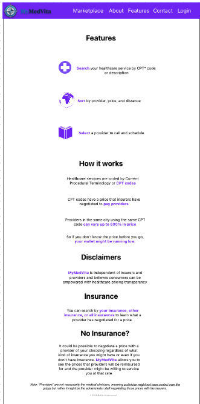
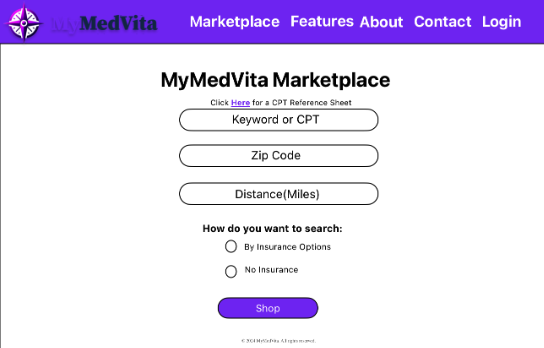
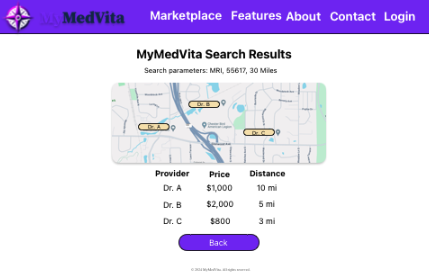
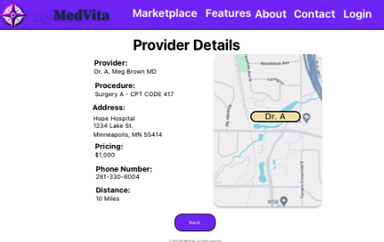
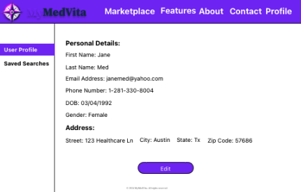
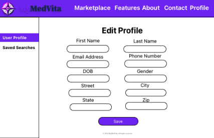
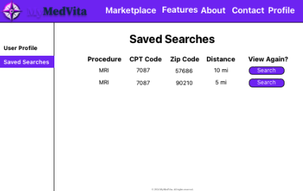

MyMedVita Web Application

<!-- PROJECT LOGO -->
 

  

  <h3 align="center">MyMedVita README</h3>

  <h4 align="center" style="color:yellow">*** DISCLAIMER ***</h4>
  
All source code for this project is protected by agreement with the client, MyMedVita, not to be shared publicly except for potential employers. If you would like to see the source code and are a potential employer, please contact me at <a href="mailto:grah0071@gmail.com">grah0071@gmail.com</a>.

  <h3 align="center">
    Please see below for detailed description of this application.
  </h3>

<!-- TABLE OF CONTENTS -->

  
Table of Contents

  <ol>
    <li>
      <a href="#about-the-project">About The Project</a>
    </li>
    <li>
      <a href="#technologies">Technologies Used</a>
    </li>
    <li><a href="#usage">Usage</a></li>
    <li><a href="#contributing">Contributing</a></li>
    <li><a href="#Acknowledgement">Acknowledgments</a></li>
  </ol>

<!-- ABOUT THE PROJECT -->

## About The Project

### Description

The MyMedVita web application is a website designed to make prices and options for medical procedures more accessible and transparent to patients. Users can search for a specific medical procedure within their area and see a variety of providers that offer that procedure along with details such as provider name/specialty, negotiated price of procedure(with or without insurance), distance to the provider, provider address, and provider phone number.

(<a href="#readme-top">back to top</a>)

### Technologies Used

---

- [Node.js](https://nodejs.org/en/)
- [PostgreSQL](https://www.postgresql.org)
- [Nodemon](https://nodemon.io)
- [React Leaflet](https://react-leaflet.js.org)
- [NodeMailer](https://www.nodemailer.com/)
- [geocodio](https://www.geocod.io/)

(<a href="#readme-top">back to top</a>)

### Third Party APIs

---

GEOCODIO
[geocodio](https://www.geocod.io/) provide geo-caching service to the server to identify the latitude and longitude of search zip codes for distance comparison. [geocodio](https://www.geocod.io/) is a fee based service with 2,500 free look-ups a day. The MyMedVita Application is built to 'remember' each look up and store the data so it any zip never has to be referred to [geocodio](https://www.geocod.io/) more than once. Other geocoding APIs are available but [geocodio](https://www.geocod.io/) was selected for this application. Requires API key to be set as environment variable.

| Tool                   | Price                                                            | Features                                                                                      | Link                                                                                                                                        |
| ---------------------- | ---------------------------------------------------------------- | --------------------------------------------------------------------------------------------- | ------------------------------------------------------------------------------------------------------------------------------------------- |
| Geocodio               | Pay as you - go 2,500 free lookups/day, then $0.50/1,000 lookups | Forward & reverse geocoding Batch List Geocoding Will geocode postal codes On-premise options | [https://www.geocod.io/](https://www.geocod.io/)                                                                                            |
| Opencage Geocoding API | Small - $50/month for 10,000 requests/day                        | Free while testing Forward & reverse geocoding No zip only option                             | [https://opencagedata.com/](https://opencagedata.com/)                                                                                      |
| Google Geocoding API   | 0–100,000 -0.005 USD per each (5.00 USD per 1000)                | Forward & reverse geocoding Maps SDK & geocoding API all in one place                         | [https://developers.google.com/maps/ documentation/geocoding/overview](https://developers.google.com/maps/documentation/geocoding/overview) |

<!-- USAGE -->

## Usage

<!-- How does someone use this application? Tell a user story here. -->

The navigation header bar will have global navigation links for all users (both authenticated and unauthenticated). Before a user logs in, the Navigation bar will display links to the About, Features, and Contact pages. Upon clicking on these links it will navigate the user to the said links.

    

Logon:
After a user logs in, the Navigation bar will display links to the Marketplace, Features, About, Contact, and Profile pages.

    

Landing Page:
The splash page is the first page users will see when navigating to the site. Users will be able to click on links; "Start Shopping" or "View Features" page.

    

Features:
The features page will show details about MyMedVita’s application features.

    

AboutPage:
The about page will show information about MyMedVita; founders, mission, and vision to users.

The Contact Page:
The Contact Page will allow users to enter their details in order to get in touch with someone from the MyMedVita team. Users will be able to enter their Name, Email, and a short message for questions or feedback.
Clicking the Submit button will send their message to support@mymedvita.com

Login Page:
The login page will allow users to enter their email address and password. Upon successful login, users will be navigated to the 1.8 MyMedVita Marketplace Page.
An unsuccessful login will alert the users via a span tag advising the user their login credentials were invalid.

Registration Page:
The Registration Page will allow users to enter their details to create an account.
The page wil collect: first name, last name, email address, password, password confirmation. These would be OPTIONAL: phone number, gender, DOB, Address.
Upon submission, users will navigate to the 1.8 MyMedVita Marketplace Page.

MarketPlace:
Users will input search parameters into a form which will collect a keyword (possibly use a searchable select), zip code, and distance as well as search type.

Selection of multiple or all insurers.

Clicking on "Click Here for a CPT Reference Sheet" will provide all the CPT codes and description.

    

Marketplace Results:
The search results page will list all results gathered from the marketplace search query:
-Provider
-Price
-Distance

Visual map of the area within the selected parameters by the user.
Note:
Provider HAS TO BE ORDERED in the following format: First Name Last Name, Credentials.

    

Providers Detail Page:
Clicking on the provider will render a details page of that provider.

The Provider Details Page will list all details for a specified provider
Results show: Provider, Procedure, Address, Price, Phone number, Distance, Map location

    

User Page and User Edit Page:
Allows the user to see the information and the edit page allows the user to edit that information.

    

    

Saved Searchers:
Allows users to see their saved searches for later reference

    

(<a href="#readme-top">back to top</a>)

### Contributing

---

This application was developed by the following group of Fullstack Software Engineering Students

- [Alvin Graham](grah0071@gmail.com)
- [Nicole Barnhouse](nicolebarnhouse@gmail.com)
- [Kevin Sieracke](ksieracke@gmail.com)
- [Jessica Yang](jessiyang1996@gmail.com)
- [Ryan Barfield](cadium828@gmail.com)
- [Sarith Seang](Sarithseang82pro@gmail.com)
- [Scott Pak](gpak86@gmail.com)

### Acknowledgement

---

Thanks to [Prime Digital Academy](www.primeacademy.io) who equipped and helped us to make this application a reality and to the MyMedVita organization in giving us a project to stretch our collective skills.
